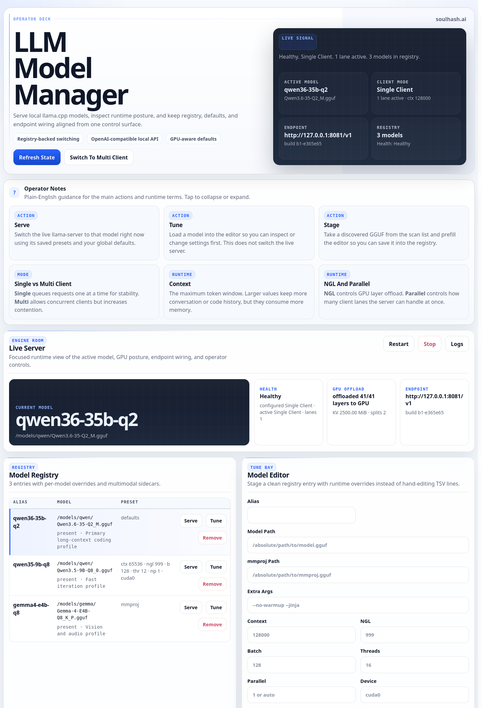

# Llama Model Manager

**by soulhash.ai**

llama-model-manager is a browser-first control surface for local llama.cpp setups. Switch models, scan GGUFs, tune runtime defaults, inspect live health, and manage single- or multi-client mode from one clean dashboard, with CLI and desktop launchers included.



## What You Get

- `bin/llama-model`: CLI wrapper for registry management, switching, restart/stop, discovery, and diagnostics
- `bin/llama-model-web`: browser dashboard launcher
- `bin/llama-model-gui`: launcher that prefers the web dashboard and falls back to Zenity
- `config/defaults.env.example`: runtime defaults template
- `config/models.tsv.example`: model registry template
- `config/HELP.txt`: end-user help text
- `desktop/llama-model-manager.desktop`: desktop launcher
- `desktop/llama-model-manager-icon.svg`: desktop icon asset used by the installer
- `scripts/build-llama-server.sh`: wrapper for fetching and compiling a host-specific llama.cpp runtime
- `web/`: browser dashboard assets and Python server
- `LICENSE`: Apache License 2.0
- `NOTICE`: copyright and attribution notice
- `install.sh`: optional local installer for user-space deployment

## Quick Install

```bash
./install.sh
```

## One-Line Install

Host `install-bootstrap.sh` at a stable URL such as `https://soulhash.ai/install_lmm.sh`, then users can install without cloning the repo first:

```bash
curl -fsSL https://soulhash.ai/install_lmm.sh | sh
```

What the bootstrap script does:

- downloads the repo tarball from GitHub into a temporary directory
- extracts it locally
- hands off to the existing `install.sh`
- cleans up the temporary download on exit

Override knobs for testing or pinned installs:

- `LLAMA_MODEL_MANAGER_REF=v1.2.3`
- `LLAMA_MODEL_MANAGER_ARCHIVE_URL=https://.../custom.tar.gz`
- `LLAMA_MODEL_MANAGER_REPO_OWNER=...`
- `LLAMA_MODEL_MANAGER_REPO_NAME=...`

### What `install.sh` Does

- installs the CLI, web UI, desktop launcher, help text, and example config files
- copies bundled runtime assets if this repo already contains them
- in an interactive terminal, offers to check/install missing build dependencies and compile a local runtime
- does **not** silently compile `llama.cpp`; it only launches the runtime build flow if the user agrees
- does **not** silently install OS packages or GPU SDKs/toolkits for you

### After Install

```bash
llama-model-web
llama-model list
llama-model doctor
llama-model build-runtime --backend auto
```

## Optional Dashboard Background Service

The dashboard normally runs on demand and does not stay resident. Advanced users can opt into a managed `systemd --user` service when they want a stable local dashboard URL without launching it manually.

Default mode:

- run `llama-model-web` when needed
- or use `llama-model-gui`
- nothing starts automatically at login unless you enable it

Advanced mode:

```bash
llama-model dashboard-service install
llama-model dashboard-service enable
llama-model dashboard-service restart
llama-model dashboard-service status
llama-model dashboard-service logs
```

The installed user unit serves the installed dashboard launcher with a fixed local URL:

- unit: `llama-model-web.service`
- URL: `http://127.0.0.1:8765/`

The background service remains fully optional and is never enabled by default.

## Runtime Portability

- llama.cpp source is portable, but built `llama-server` binaries are backend-, platform-, and architecture-specific
- this repo does not assume one bundled GPU binary works everywhere
- `llama-model doctor` reports host backends, selected binary source, and compatibility status
- if no safe runtime is available, run `llama-model build-runtime --backend auto` or `./scripts/build-llama-server.sh --backend auto`

### What `llama-model build-runtime` Does

- clones or updates `https://github.com/ggml-org/llama.cpp.git`
- checks out the configured `llama.cpp` ref
- builds a host-specific `llama-server` runtime for the selected backend
- also builds a CPU fallback runtime
- writes compatibility metadata so the manager can reject mismatched bundled binaries later

### What `llama-model build-runtime` Does Not Do

- it does **not** silently run `apt`, `dnf`, `pacman`, `brew`, or any other package manager without asking first
- it does **not** install unsupported toolchains or SDK paths by guesswork
- it does **not** try to guess a safe third-party GPU binary from another machine

### Interactive Dependency Assistance

- when `llama-model build-runtime` sees missing build tools in an interactive terminal, it:
  - tells the user exactly what is missing
  - shows the install commands it plans to run
  - asks for confirmation first
  - runs the detected system package manager when it knows a sane command for that host
- this currently covers common package-manager flows such as `apt-get`, `dnf`, `pacman`, `zypper`, and `brew`, plus `xcode-select --install` for macOS command line tools
- if the host package manager or SDK path is unsupported, the script stops and tells the user what still needs to be installed manually

### Recommended First-Run Flow

```bash
./install.sh
llama-model doctor
llama-model build-runtime --backend auto
llama-model doctor
llama-model-web
```

If `doctor` reports `binary_status: unavailable`, install the missing build dependencies for that machine and run `llama-model build-runtime --backend auto` again.

## Key Features

- browser dashboard for switching models, importing discovered GGUFs, editing presets, and checking runtime health
- structured registry entries with per-model overrides for context, `ngl`, batch, threads, parallel, device, and notes
- automatic discovery of `.gguf` models plus same-directory `mmproj` sidecars
- CLI diagnostics via `llama-model doctor`
- manifest-driven runtime selection that only accepts validated bundled binaries
- local `llama.cpp` bootstrap via `llama-model build-runtime`
- OpenAI-compatible endpoint summary plus sync wiring for local harnesses such as `opencode`, `OpenClaw`, and `Claude Code`
- Modern Operator dashboard treatment with toasts, busy states, and first-run empty states

## Supported Integrations

Current public integration support:

- `opencode`
  - direct sync to the live local OpenAI-compatible `llama.cpp` endpoint
  - CLI: `llama-model sync-opencode --preset balanced|long-run`
  - dashboard action: `Sync opencode`
- `OpenClaw`
  - direct sync to the live local OpenAI-compatible `llama.cpp` endpoint
  - CLI: `llama-model sync-openclaw`
  - dashboard action: `Sync OpenClaw`
- `Claude Code`
  - syncs local Claude settings to a local Anthropic-compatible gateway target
  - CLI: `llama-model sync-claude`
  - dashboard action: `Sync Claude`
- `Claude gateway`
  - local bridge in front of the active `llama.cpp` endpoint for Claude Code compatibility
  - CLI: `llama-model claude-gateway start|stop|restart|status|logs`
  - dashboard controls: `Start`, `Restart`, `Stop`, `Logs`
- `GlyphOS AI Compute`
  - syncs `~/.glyphos/config.yaml` to the active local `llama.cpp` runtime
  - CLI: `llama-model sync-glyphos`
  - dashboard action: `Sync GlyphOS`

These integrations are optional. The default product behavior remains the local `llama.cpp` runtime plus the on-demand dashboard.

## Dependencies

- `python3` is required for the web dashboard
- `zenity` is optional and only needed for the legacy fallback UI
- `git`, `cmake`, and a C++ compiler are required if you want the repo to fetch and build `llama.cpp` locally
- CUDA builds need the CUDA toolkit, Vulkan builds need Vulkan SDK/shader tools, and Metal builds need Xcode command line tools
- the runtime build script fetches `llama.cpp` source automatically, but system dependencies must already be present
- the scripts use XDG-style config/state locations under `~/.config/llama-server` and `~/.local/state/llama-server`
- `LLAMA_SERVER_PARALLEL=1` is recommended for a single coding harness because it avoids parallel slot pressure without reducing context length
- set `LLAMA_MODEL_UI=zenity` if you want to force the old Zenity UI instead of the browser dashboard

## Bundled Local Packages

- public GlyphOS AI Compute package is vendored locally under `integrations/public-glyphos-ai-compute/`
- this bundled copy contains only the public glyph + AI routing layers
- the private Q45 / quantum stack is intentionally not included here

## Client Sync

- `opencode` keeps its own local client config in `~/.config/opencode/opencode.json`, so it can keep pointing at a stale GGUF even after `llama-model switch`.
- `llama-model sync-opencode` updates the `llamacpp` provider endpoint, default model, and local model-state wiring to match `llama-model current`.
- `llama-model sync-openclaw` updates `~/.openclaw/openclaw.json` or `~/.openclaw-<profile>/openclaw.json` so OpenClaw points directly at the live local endpoint.
- `llama-model sync-claude` writes `~/.claude/settings.json` for Claude Code, and `llama-model claude-gateway` runs a local Anthropic-compatible bridge in front of the current llama.cpp server.
- `llama-model sync-glyphos` writes `~/.glyphos/config.yaml` so the bundled public GlyphOS AI Compute package can target the active local `llama.cpp` endpoint directly.
- the dashboard exposes direct sync actions for all three tools and gateway controls for Claude Code.

## Common Commands

```bash
llama-model list
llama-model show gemma4-e4b-q8
llama-model add gemma4-e4b-q8 /absolute/path/to/Gemma-4-E4B-Q8_K_P.gguf --mmproj /absolute/path/to/mmproj-Gemma-4-E4B-f16.gguf
llama-model discover ~/models
llama-model build-runtime --backend auto
llama-model switch qwen35-9b-q8
llama-model sync-opencode --preset balanced
llama-model sync-opencode --preset long-run
llama-model sync-openclaw --profile lmm-eval qwen35-9b-q8
llama-model sync-claude qwen35-9b-q8
llama-model claude-gateway start
llama-model sync-glyphos
llama-model doctor
```

## License

- Copyright `2026 soulhash.ai`
- Licensed under `Apache-2.0`
- The code is free to use under the license terms while `soulhash.ai` remains the copyright owner
